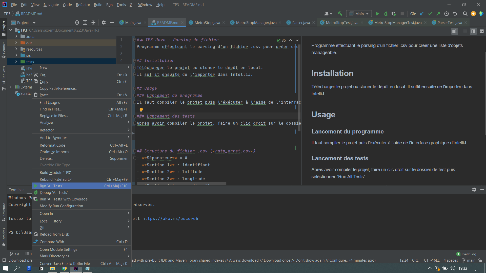

# ♨ TP3 Java - Parsing de fichier
Programme effectuant le parsing d'un fichier .csv pour créer une liste d'objets manageable.

 

## ✨ Installation
Télécharger le projet ou cloner le dépôt en local.
Il suffit ensuite de l'importer dans IntelliJ.

 

## 🚀 Utilisation
### Lancement du programme
Il faut compiler le projet puis l'éxécuter à l'aide de l'interface graphique d'IntelliJ.

### Lancement des tests
Après avoir compiler le projet, faire un clic droit sur le dossier de test puis séléctionner "Run All Tests".

 

## 📝 Détails sur le programme
### Structure du fichier .csv (*ratp_arret.csv*)
- **Séparateur** = #
- **Section 1** : identifiant
- **Section 2** : latitude
- **Section 3** : longitude
- **Section 4** : nom d'arrêt
- **Section 5** : arrondissement
- **Section 6** : moyen de transport

### Utilité des classes
**Main.java** : lance le programme et affiche le menu. 
**MetroStop.java** : modélise les arrêts de métro. 
**Parser.java** : parse le fichier .csv et rempli une liste de MetroStop avec les informations récupérées. 
**MetroStopManager.java** : gère les actions sur la liste de MetroStop (tri et affichage).

